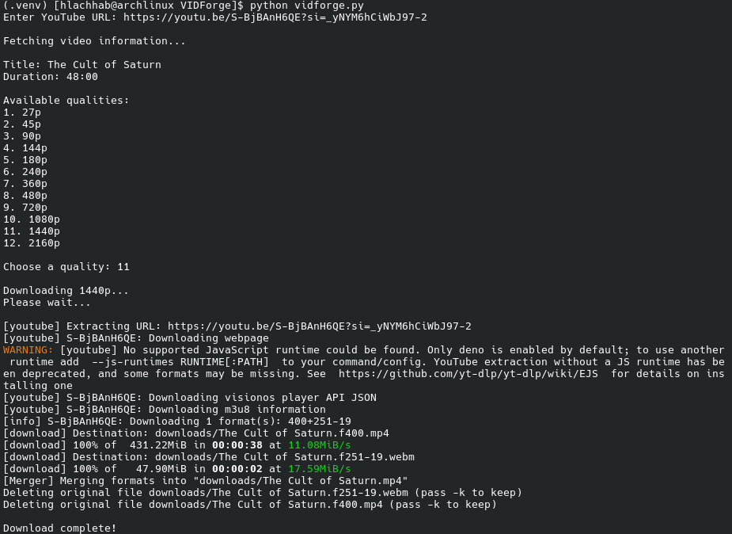

# VidForge V1

Simple program that lets you download YouTube videos in any available quality.
## Features

- Fetch video information
- View available video qualities
- Choose the desired quality
- Download videos locally
- Merge video and audio using FFmpeg

## Requirements

- Python 3
- [yt-dlp](https://github.com/yt-dlp/yt-dlp)
- FFmpeg

Make sure Python, yt-dlp, and FFmpeg are installed and available in your PATH.

## Usage

```bash
mkdir downloads #for storing downloaded videos
python vidforge.py
```

Enter a YouTube URL, choose the available quality, and start the download.




## Future Updates

I plan to add more features, including:

- Downloading subtitles in any available language
- More download options
- Improved error handling
- Other features to make VidForge more useful and easier to use

If you find a bug or have an idea that could make VidForge more useful or easier to use, feel free to contact me or open an issue.

## Disclaimer

For personal and educational use. Respect YouTube's Terms of Service and applicable copyright laws.


